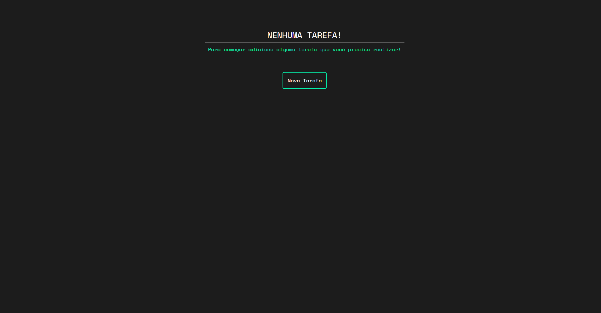

<h1>TODO LIST</h1>

Esse projeto é uma lista de tarefas, foi usado a ferramenta [Vite](https://vitejs.dev) e o [ReactJS](https://pt-br.reactjs.org) para o desenvolvimento do projeto.

<h2>Imagens:</h2>



<h2></h2>


<h2></h2>


<h2>Funcionalidades:</h2>

- Texto dinâmico.
- Modal para adicionar tarefa.
- Validação do input.
- Armazenamento no LocalStorage.
- Checkbox para marcar como tarefa completa.

# Rodando o projeto:
OBS: É necessário que tenha o [NodeJS](https://nodejs.org/en/) e o [Git](https://git-scm.com) instalado em sua maquina.

```bash 
1. Clone o repositório:
$ git clone https://github.com/gabriellima2/todo-list-reactjs.git

2. Acesse a pasta e instale as dependências via terminal:
$ npm install

3. Inicie a aplicação em modo de desenvolvimento:
$ npm run dev

4. O servidor será aberto em http://localhost:3000
```
